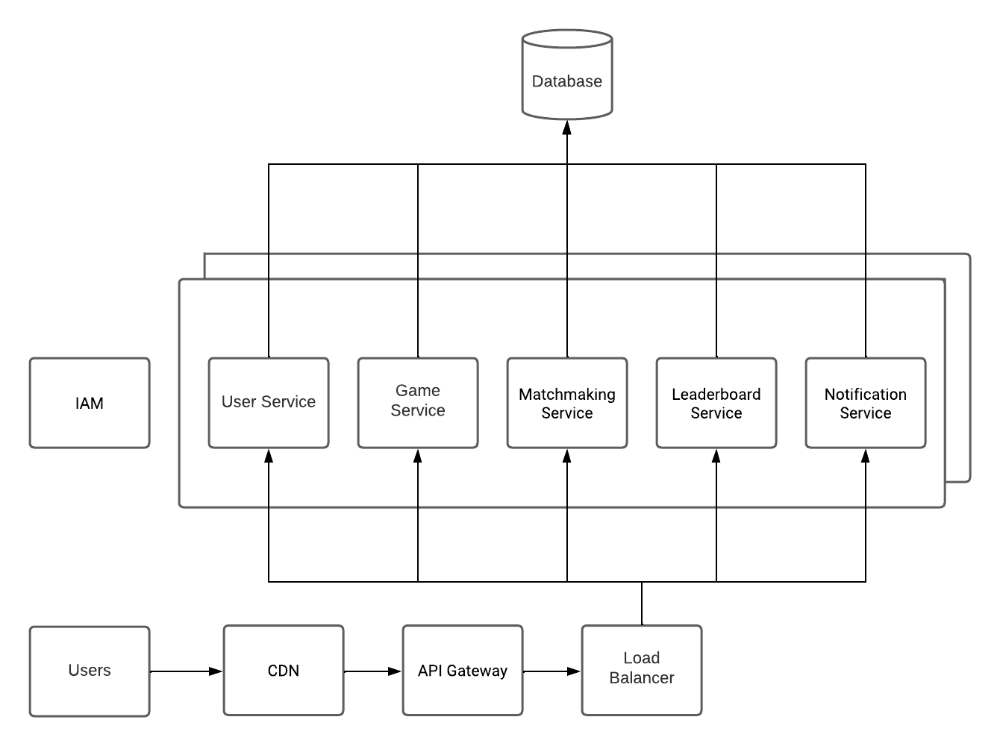

# Tic-Tac-Toe API Service 
This project is a service of the Tic-Tac-Toe game developed with Flask. The goal is to provide an interactive API where users can enjoy playing the classic Tic-Tac-Toe game. This document will serve as a comprehensive guide to understanding, installing, and utilizing this service.

## Project Structure
1. app/: The main folder containing the application's source code.
   - app.py: The main file that initiates and configures the Flask application.
   - your_database.py: A file associated with the configuration or management of the project's database.
   - models/: A directory containing the data models used in the application.
   - controllers/: A directory containing the application's controllers, which manage the data flow between models and views.
   - services/: A directory containing various services utilized in the application, like services to manage specific business logics.
   - test_app.py: A file containing unit tests for the application, ensuring that the main functionalities are working as expected.
2. requirements.txt: A file listing all the necessary Python dependencies for the project.
3. Dockerfile: A file containing instructions to create a Docker image for the project.
4. docker-compose.yml: A file used to define and run multi-container applications with Docker.

## Installation and Execution
##### Local Environment Setup
1. Setting Up a Virtual Environment (Optional)
To avoid conflicts with dependencies, it is recommended to create a virtual environment. You can do this using the following command:
```bash
    python3 -m venv env
    source env/bin/activate  # On Windows, use `env\Scripts\activate`
```
2. Installing Dependencies
Once the environment is set up, you can install the necessary dependencies using the following command:
```bash
    pip3 install -r requirements.txt
```
3. Execution
To run the project locally, navigate to the project folder and use the following command:
```bash
    python app/app.py
```
##### Execution with Docker
To run this project using Docker, you will need to have [Docker](https://docs.docker.com/get-docker/) and [Docker Compose](https://docs.docker.com/compose/install/) installed. Once you are ready, use the following commands:
```bash
docker-compose up --build
```
# API Documentation

##### Overview
This documentation describes the endpoints of the Tic Tac Toe game API. Each endpoint has detailed information including the URL, HTTP method, parameters, and possible responses.

##### Endpoints

1. **User Registration**
- **URL**: /register
- **HTTP Method**: POST
- **Parameters**:
    ```bash
    {
        "username": "The username to register.",
        "password": "The password to associate with the username."
    }
    ```
- **Expected Responses**:
    - 201 Created: If the registration was successful, along with the user details.
    - 400 Bad Request: If the registration failed, with an error message.
- **Response Format**:
    ```bash
    {
        "id": "User ID",
        "username": "Registered username"
    }
    ```

2. **User Login**
- **URL**: /login
- **HTTP Method**: POST
- **Parameters**:
    ```bash
    {
        "username": "The username to log in.",
        "password": "The password associated with the username."
    }
    ```
- **Expected Responses**:
    - 200 OK: If the login was successful, along with the user details and JWT token.
    - 400 Bad Request: If the login failed, with an error message.
- **Response Format**:
    ```bash
    {
        "id": "User ID",
        "username": "Username",
        "token": "JWT token"
    }
    ```

3. **Create a New Game**
- **URL**: /game
- **HTTP Method**: POST
- **Headers**:
    - Authorization: JWT token obtained after login.
- **Parameters**: None
- **Expected Responses**:
    - 201 Created: If the game was created successfully, along with the game details.
    - 401 Unauthorized: If authentication fails, with an error message.
- **Response Format**:
    ```bash
    {
        "{matchID": "Game ID"
    }
    ```

4. **Make a Move in an Existing Game**
- **URL**: /move
- **HTTP Method**: POST
- **Headers**:
    - Authorization: JWT token obtained after login.
- **Parameters**:
    ```bash
    {
        "game_id": "ID of the game where the move is being made.",
        "player": "The player making the move ('X' or 'O').",
        "x": "The x-coordinate of the move.",
        "y": "The y-coordinate of the move."
    }
    ```
- **Expected Responses**:
    - 200 OK: If the move was successfully executed, along with the current state of the game.
    - 400 Bad Request: If the move failed, with an error message.
    - 401 Unauthorized: If authentication fails, with an error message.
- **Response Format**:
    ```bash
    {
        "id": "Game ID",
        "board": "Current state of the game board",
        "winner": "Winner of the game (if any)",
        "current_player": "The player whose turn it is to move"
    }
    ```

 5. **Get the Current Status of a Game**
- **URL**: /status/<game_id>
- **HTTP Method**: GET
- **Headers**:
    - Authorization: JWT token obtained after login.
- **Parameters**:
    - game_id: ID of the game whose status is being retrieved (passed as part of the URL).
- **Expected Responses**:
    - 200 OK: If the game is found, along with the current state of the game.
    - 401 Unauthorized: If authentication fails, with an error message.
    - 404 Not Found: If the specified game is not found, with an error message.
- **Response Format**:
    ```bash
    {
        "id": "Game ID",
        "board": "Current state of the game board",
        "winner": "Winner of the game (if any)",
        "current_player": "The player whose turn it is to move"
    }
    ```

##### Notes
1. The `board` attribute in the Game response format is a string of length 9, representing the Tic Tac Toe board. The positions are indexed from 0 to 8, starting from the top left to the bottom right (row-wise).
2. The `winner` attribute in the Game response format can be 'X', 'O', 'draw' (in case of a tie), or `null` (if the game is ongoing).
3. The `current_player` attribute in the Game response format can be 'X' or 'O', indicating whose turn it is to make a move.

## Tests
The execution of unit tests is a crucial step to ensure the functionality and stability of the project. Below, details on how to run the tests and what specific aspects of the project are being tested are provided.

##### Test Execution
To run the unit tests, follow the steps below:

1. **Environment Preparation:** Make sure that all dependencies are correctly installed as described in the installation section.

   Once the environment is set up, you can install the necessary dependencies using the following command:

```bash
   pip3 install -r requirements.txt
```

2. **Test Execution:**  Navigate to the project's root folder in your terminal and execute the following command to start the unit tests:

```bash
    pytest app/test_app.py
```

The unit tests in the app/test_app.py file are designed to verify various aspects of the project. Below, each of the test functions present in the file and the aspect of the project being tested by each function are described:

- **test_register_and_login:** This function tests the user registration and login flow. It ensures that users can register and then successfully log in using their credentials.

- **test_game_flow:** This function tests the general flow of a Tic Tac Toe game, ensuring that the game functions as expected from the beginning to the end of a match.

- **test_user_model:** This function tests the user model, ensuring that operations related to users, such as creation and query, function correctly.

- **test_make_move:** This function tests the functionality of making a move in the game, ensuring that moves are processed correctly and that the game state updates as expected.

## User management service design

##### New “Users” feature 
In the next phase of our project, we aim to introduce a comprehensive user management system, building on the initial services. This new feature will offer an enhanced layer of personalization and community engagement within the gaming platform. Features may include personalized user dashboards, friend lists, and game history tracking.

##### API Changes
We plan to expand the current API structure to incorporate more detailed user management functionalities.

1. Current Endpoints (located in auth_controllers.py):

- **POST /auth/register:** Allows users to register by providing a username and password.
- **POST /auth/login:** Facilitates user login with username and password validation.
2. New Endpoints:

- **GET /user/{user_id}/profile:** To retrieve detailed user profile information, including game statistics and preferences.
- **POST /user/{user_id}/profile:** Allows users to update their profile details.
- **GET /user/{user_id}/friends:** Retrieves a list of friends associated with the user's profile.
- **POST /user/{user_id}/friends:** Enables users to add new friends to their profile.

##### Required Database Structure Changes
Building on top of `user model`, we propose the following database structure expansions to accommodate the new features:

- **Profile Details Table:** To store additional user details such as preferences, personal info and game statistics.
- **Friend List Table:** A new table to manage user connections, recording friend lists and friend requests.
- **Game History Table:** To log individual game sessions and outcomes, enabling users to revisit their game histories.

##### Architectural Design Changes
To fully integrate the new user management features and align with the proposed microservices architecture, several architectural changes will be necessary. These include:

- **User Service:** Managing user profiles and data, including new functionalities to record preferences and game statistics.
- **Matchmaking Service:** Enhancing to facilitate connections between friends and ensure fair player matching.
- **Notification Service:** Expanding to include notifications for friend requests and messages.
- **API Gateway:** Updating to manage the routing of new endpoints efficiently and securely.
- **Database:** Adjusting the database structure to incorporate new tables and relationships seamlessly.

## Cloud Microservices Design
In this section, we present a high-level overview of a potential cloud-based microservices infrastructure suitable for a full-featured, large-scale online Tic-Tac-Toe service. This design is tailored to ensure scalability, security, privacy, and high availability.

##### Overview
The proposed architecture leverages cloud computing and microservices design principles to craft a robust and scalable online Tic-Tac-Toe service. The system is segmented into several independent microservices, each catering to a specific function, facilitating efficient scalability and maintenance. Furthermore, the infrastructure integrates security and privacy measures to safeguard user data and foster a secure gaming environment.

##### Architecture Diagram
The forthcoming architecture diagram will depict the various components of the system and their interrelationships. Here, we detail each component comprehensively:

- **User Service:** Manages user profiles and data, responsible for storing and retrieving user information such as profile details, preferences, and game statistics.

- **Game Service:** Oversees game mechanics and rules, responsible for managing game sessions and ensuring the game rules are upheld correctly.

- **Matchmaking Service:** Connects players looking to play a game, ensuring fair player matching.

- **Leaderboard Service:** Manages and displays player rankings, fostering friendly competition.

- **Notification Service:** Sends notifications to users about game updates, invitations, and other relevant events.

- **API Gateway:** Serves as a singular entry point for all client requests, directing them to the appropriate services.

- **Identity and Access Management (IAM):** Manages user identities and controls access to services, ensuring only authorized users can access certain functionalities.

- **Database:** Securely stores user data and game information, complying with privacy regulations.

- **Content Delivery Network (CDN):** Ensures fast and reliable delivery of game assets and content to users worldwide.

- **Load Balancer:** Distributes incoming network traffic across multiple servers to prevent any single server from becoming overwhelmed with too much traffic.

